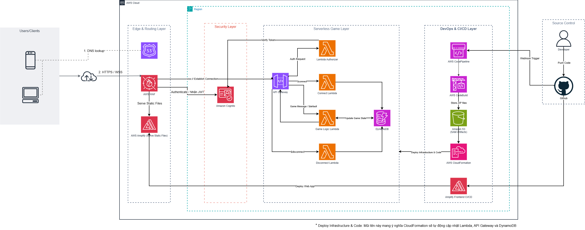

# Real-time Serverless Game Platform
## Unified AWS Serverless Solution for Real-time Multiplayer Gaming

### 1. Executive Summary
The **DoAnMiniGame** project is designed to build an optimized Real-time Multiplayer Game Platform. The system seamlessly handles high-concurrency connection streams from a Flutter-based client application. By fully leveraging the power of the **AWS Serverless** model and an automated **CI/CD pipeline (GitHub Actions + AWS SAM)**, the platform completely eliminates physical server management overhead, provides real-time monitoring, enhances security, and optimizes operational costs based strictly on actual resource consumption.

### 2. Problem Statement
*Current Status*
Traditional multiplayer game architectures require maintaining dedicated server clusters running 24/7, leading to high fixed costs even when there are no active players. Furthermore, manual Auto-scaling configurations often fail to respond in time during sudden traffic spikes, resulting in network bottlenecks or system crashes. Synchronizing the real-time Game State across multiple game rooms is also complex and demands an infrastructure with ultra-low latency.

*Proposed Solution*
The platform utilizes **Amazon API Gateway (WebSocket API)** to maintain persistent, bi-directional connections, **AWS Lambda** for event-driven decoupled game logic processing, and **Amazon DynamoDB** as the NoSQL database to store connection sessions (`Connections`) and game room states (`Games`). The Edge Phasing & Ingress Layer is streamlined by deploying **AWS Amplify (Web Hosting & CDN)** for stable Flutter Web distribution, integrated with **AWS WAF** for DDoS mitigation and **Amazon Route 53** for DNS resolution. The deployment pipeline is fully automated via **GitHub Actions** working in tandem with the **AWS SAM CLI** to package and deploy the infrastructure as code (IaC).

*Benefits and Return on Investment (ROI)*
The solution establishes a solid foundation for a real-time multiplayer gaming system that operates reliably with single-digit millisecond latency and autonomous auto-scaling capabilities. It removes the burden of infrastructure administration, simplifies source code updates for both backend and frontend, and improves game room data reliability. Estimated monthly operational costs are highly optimized as most services fall within the AWS Free Tier during the testing phase, ensuring a rapid return on investment by maximizing savings on fixed server resources.

### 3. Architecture Design
The platform adopts a Serverless Game Topology to manage long-lived real-time connection sessions from the Flutter client. The entire infrastructure is defined as code (IaC) via an AWS SAM template to guarantee architectural consistency.

*AWS Services Utilized*
- **AWS Amplify**: Hosts and distributes the Flutter Web application interface.
- **AWS Lambda**: Handles game business logic, authentication, and event broadcasting (4 Node.js functions).
- **Amazon API Gateway**: Establishes the WebSocket API gateway to route packets based on JSON actions.
- **Amazon DynamoDB**: Stores player sessions and game room states (2 NoSQL tables).
- **Amazon Route 53 & AWS WAF**: Resolves DNS Aliases and applies edge firewalls to block spam bots and enforce rate limits.
- **Amazon Cognito**: Manages registration, login, and issues JWT tokens to authenticate players.
- **Amazon CloudWatch**: Monitors system logs, with restricted retention periods to prevent unexpected costs.

*Component Design*
- **Client Application**: A Flutter App integrated with the AWS Amplify SDK for the Auth flow, establishing a direct `wss://` protocol connection to the API Gateway.
- **Ingress & Edge Security**: Route 53 routes traffic through AWS WAF protection, forwarding connection packets to the Cognito Lambda Authorizer for validation.
- **Data Processing**: AWS Lambda intercepts events from the API Gateway, records connection states in DynamoDB, executes business logic, and broadcasts game room status updates.
- **Data Storage**: The `Connections` table stores active sessions (configured with a Global Secondary Index on `roomId`); the `Games` table manages the state matrix of game rooms. Both tables have Time to Live (TTL) enabled for automated data cleanup.

### 4. Technical Implementation
*Implementation Stages*
The project is executed comprehensively across 4 progressive stages:
1. **Research and Architecture Drafting**: Research the WebSocket API Gateway protocol, design NoSQL schema structures for DynamoDB, and finalize the system architecture blueprint on Draw.io.
2. **Cost Estimation and Feasibility Check**: Use the AWS Pricing Calculator to forecast the operational budget and set up cost billing alarm thresholds.
3. **Architectural Refinement for Cost/Solution Optimization**: Refine the system into a fully serverless model. Migrate the web frontend interface layer to **AWS Amplify**, and shift the CI/CD pipeline to **GitHub Actions + AWS SAM** to maximize Infrastructure as Code (IaC) deployment efficiency.
4. **Development, Testing, and Deployment**: Write the Lambda Node.js source code, program the Flutter client application, configure automated CI/CD workflows, and conduct system load testing using wscat.

*Technical Requirements*
- **Development Environment**: Local workstations must have AWS CLI v2, AWS SAM CLI, Node.js 18+, Flutter SDK, and wscat pre-installed.
- **Backend Infrastructure (IaC)**: The entire structural setup of API Gateway, Lambda, and DynamoDB is centrally defined in the AWS SAM `template.yaml` file, utilizing environment variables to avoid hardcoded configurations.
- **Frontend Application (Flutter)**: Integrates the `amplifyconfiguration.dart` configuration file to synchronize authentication with the Cognito User Pool. Employs `flutter_secure_storage` on the client side to secure JWT tokens.

### 5. Roadmap & Milestones
- **Pre-Internship (Month 0)**: 1 month of planning, researching real-time WebSocket connection mechanics, and drafting the Draw.io architecture.
- **Internship (Months 1–3)**:
    - **Month 1**: Master the AWS SAM CLI to define IaC resources. Provision the Amazon Cognito User Pool and configure IAM Roles adhering to the Least Privilege principle.
    - **Month 2**: Create DynamoDB Tables, establish Indexes, and configure TTL. Program the source code for the 4 Node.js Lambda functions and set up routing routes for the WebSocket API Gateway.
    - **Month 3**: Finalize the Flutter application, and configure GitHub Actions workflow files to automate concurrent testing and deployment for both Web (Amplify) and Backend (SAM). Deploy CloudWatch Alarms to send email alerts if Lambda execution errors trigger.

### 6. Budget Estimation
Monthly operational cost projection (Calculated via the AWS Pricing Calculator for the Singapore region `ap-southeast-1`):

- **AWS Lambda**: 0.00 USD/month (Covered under the Free Tier tier with 1 million free requests).
- **Amazon API Gateway (WebSocket)**: 0.00 USD/month (Covered under the Free Tier tier with 1 million free messages).
- **Amazon Cognito**: 0.00 USD/month (Completely free under the Monthly Active Users (MAUs) tier).
- **AWS Amplify**: ~0.35 USD/month (Minor accumulated costs based on Web app hosting storage).
- **Amazon DynamoDB**: ~0.30 USD/month (Billed based on actual On-Demand data consumption volume).
- **Amazon CloudWatch**: ~0.15 USD/month (Optimized by restricting log retention settings to 14 days).
- **AWS WAF**: ~5.00 USD/month (Fixed maintenance cost for 1 basic Web ACL at the edge layer).

**Total**: ~5.80 USD/month, approximately ~69.60 USD for 12 months. The entire source code and repositories utilize cloud infrastructure, causing zero hardware server purchasing expenses.

### 7. Risk Assessment
*Risk Matrix*
- **Zombie Connections**: Players push the app to the background without closing the WebSocket connection, causing the system to continue incurring continuous maintenance tracking overhead (Impact: Medium | Probability: High).
- **Cold Start Delay**: Lambda functions left idle for extended periods will have their execution environments reclaimed, causing the first player who connects to experience a 1–3 second initialization delay (Impact: Low | Probability: Medium).
- **Credential Leak**: Accidental commits of files containing AWS Access Keys to public repositories on GitHub (Impact: Critical | Probability: Low).

*Mitigation Strategies & Contingency Plans*
- **Handling Hung Connections**: The Client side (Flutter) automatically terminates the WebSocket connection as soon as the app transitions to background mode. The Lambda backend integrates a Heartbeat mechanism (Ping/Pong) combined with DynamoDB's TTL attribute to purge stale connections.
- **Mitigating Cold Starts**: Initialize external SDK connections outside the main execution handler `exports.handler` to reuse execution environments. Minimize backend deployment package sizes using the `npm ci --production` command.
- **Source Code Security**: Append all `.env` files to the `.gitignore` exclusion file list before committing code. Set up an AWS Billing Alert monitoring system to receive urgent alerts as soon as the account exceeds desired budget limits.

### 8. Expected Outcomes
*Technical Improvements*: Successfully deliver a real-time multiplayer gaming system running on a Serverless Event-driven architecture that complies with operational security standards. The game runs smoothly with minimal latency, eliminates network bottlenecks, and auto-scales dynamically based on active user volume.
*Long-term Value*: The complete infrastructure-as-code definitions (SAM Template) and GitHub Actions workflow pipelines are cleanly packaged, providing a robust foundation for the development team to easily scale the game project in the future.
