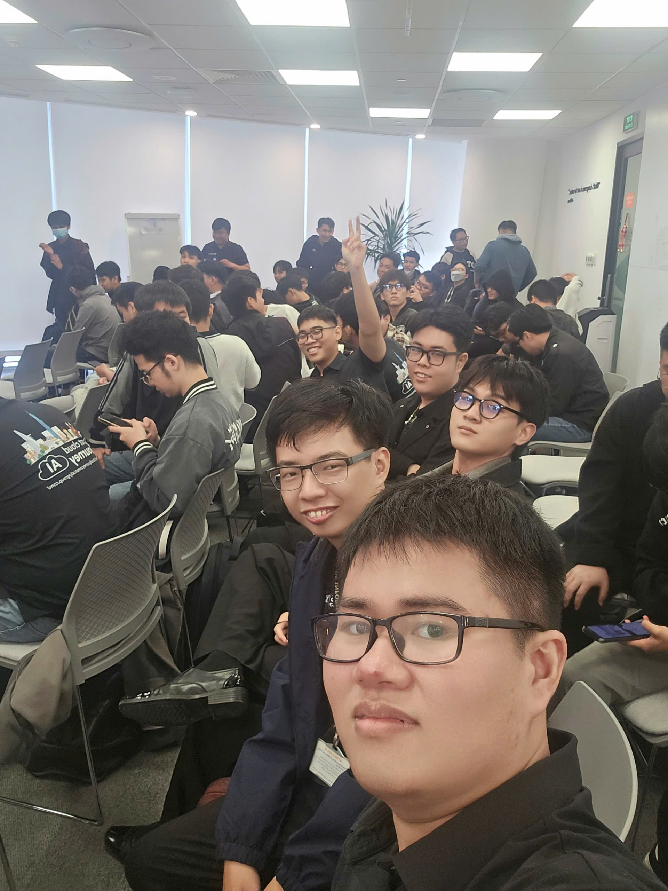

### Event Objectives

- **Trend Updates & Real-world Insights:** Provide the IT engineering community and students with realistic enterprise perspectives on how corporations are leveraging AI across departments to address Technical Debt.
- **Engineering & Operations Optimization:** Introduce application modernization methods using Agentic Architecture (Single-Agent, Multi-Agent), enhancing observability and automated incident response for Cloud infrastructure (DevOps AI Agent).
- **Localization & Security Solutions:** Guide the development of localized Voice AI specialized for Vietnamese (handling regional dialect challenges and conversational context), and detail methods for setting up Private Security Connections to protect internal enterprise data.
- **Career Orientation:** Help tech talents define their Career Path, connect early with enterprise environments, and equip themselves with essential skills for effective human-AI collaboration.

### Keynote Speakers

- **Mr. Steve Tran** – Founder & CEO at Cloud Thinker (Former Solutions Architect at Amazon Web Services).
- **Mr. Hieu Nghi** – Representative from Renova Cloud.
- **Mr. Kiet** – Representative from AWS Student Builder Group Community.
- **Mr. Trung Nguyen** – Founder & CEO at R AI (Expert in AI Agent solutions for major banks such as VPBank, VIB).
- **Ms. Bao & Mr. Nguyen Nguyen** – Cloud Engineers from Cloud Kinetics.
- **Mr. Truong (Wren) & Ms. Minh Anh** – AI Solution Specialists from Noventic.
- **Mr. Toan Nguyen** – AWS Security Builder.

### Featured Content

#### 1. Agent Architecture Trends in Enterprise (Cloud Thinker)
- Trade-off analysis regarding cost and performance between Single-Agent (Super Agent) and Multi-Agent (Specialist Agents) architectures.
- How AI effectively assists engineers in Production Environment operations, cost optimization (FinOps), code reviews, and automated penetration testing.

#### 2. Vietnamese Voice AI Agent Technology (R AI & Renova Cloud)
Solving the challenge of Vietnamese as a Low-resource language using an integrated 3-component model:

  
Speech-to-Text (STT)

  
&rarr;

  
LLM Context Processing

  
&rarr;

  
Text-to-Speech (TTS)

- Handling advanced real-world interaction nuances in Banking: Gender detection for appropriate honorifics, endpoint detection algorithms for natural barge-in/interruption, and Tool Calling integration to execute complex tasks automatically (e.g., locking bank cards).

#### 3. DevOps AI Agent Infrastructure (Cloud Kinetics)
- Introduction of the 6 core pillars of DevOps Agents to automate Root Cause Analysis (RCA) upon receiving alerts/incidents.
- Practical case-study simulation: An e-commerce system under a simulated DDoS attack experiences latency spiking to 12 seconds. The DevOps Agent automatically scans the full system Topology Graph containing nearly 300 links, pinpointing the exact failure source and generating remediation code to restore the application within minutes.

#### 4. HR Management Applications & Private Connection Security (Noventic)
- Leveraging Amazon Q/Quick to build Skills for automated multi-CV parsing and scoring compatibility against job descriptions (JDs), reducing manual screening workload.
- **Advanced Technical Solution:** Deploying MCP Server inside a Private Subnet, connecting via AWS internal network using Interface Endpoints, and integrating AWS Secrets Manager with Route 53 Resolver to completely eliminate internet attack surface exposure and Man-in-the-middle risks.

### Key Takeaways

#### Modern Engineer Mindset
- **AI as a Lever:** Solid technical fundamentals remain core; AI serves as a powerful assistant acting as a lever to amplify productivity rather than replacing humans completely.

#### Systems Engineering & Security
- **Sustainable Infrastructure:** Emphasizing comprehensive data governance, system observability, and isolated internal connectivity via Private VPC Connections.

#### Proactive Strategy
- **Career Development:** Proactively gaining real-world exposure through early enterprise internships and optimizing resumes (CVs) aligned with key technical terms to match modern recruitment trends.

### Event Highlights & Experience

Participating in the **“FCAJ Community Day - June 2026”** conference provided an engaging, deep-dive experience:

- **Learning from Industry Experts:** Gained deep insights from senior professionals on actual career paths, how enterprises balance infrastructure costs, and workforce restructuring when adopting GenAI.
- **Hands-on Technical Experience:** Witnessed live stage demos: from testing Voice AI handling Vietnamese conversations with natural interruptions, to watching DevOps Agents isolate infrastructure bugs and suggest remediation code during a DDoS incident.
- **Modern Tooling Adoption:** Explored cutting-edge tools within the AWS ecosystem such as Amazon Q, Amazon Quick, and SDKs supporting Model Context Protocol (MCP) server connections. Learned how to set up isolated logical spaces (Agent Spaces) for data access control.
- **Networking & Discussion:** Experienced the tech workspace at the AWS Vietnam office (Bitexco Financial Tower), networking directly with experts and peers. Engaged in vibrant discussions regarding Data Transfer Cost optimization and Context Window management.

#### Event Gallery

> **Summary:** This event reinforced my technical and security-focused mindset essential for a future Solutions Architect—deepening my understanding of real-world DevOps Agent operations and secure, isolated connection architectures for enterprises.