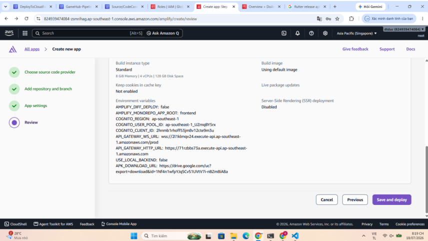
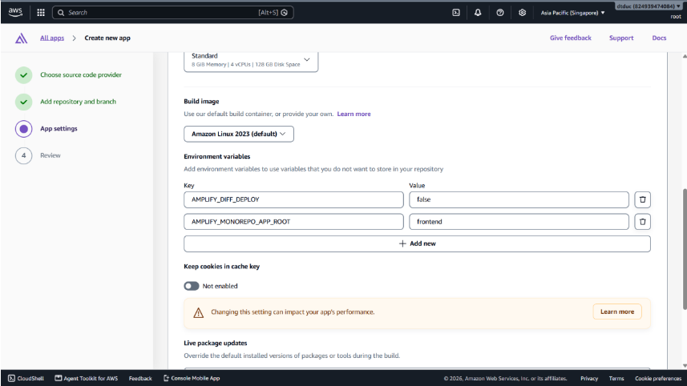

#### Goal

In this step, you will review the entire configuration before saving and deploying the frontend to AWS Amplify.

#### Instructions

1. After entering all required information, click `Next` to go to the `Review` page.
2. Review the configuration one more time.
3. Click `Save and deploy` to begin the build and deployment process.
4. AWS Amplify will automatically pull the source code, install Flutter, and deploy the web application to the cloud.

#### Expected result

Once deployment succeeds, your frontend will be hosted on AWS Amplify and available through the URL provided by the service.
